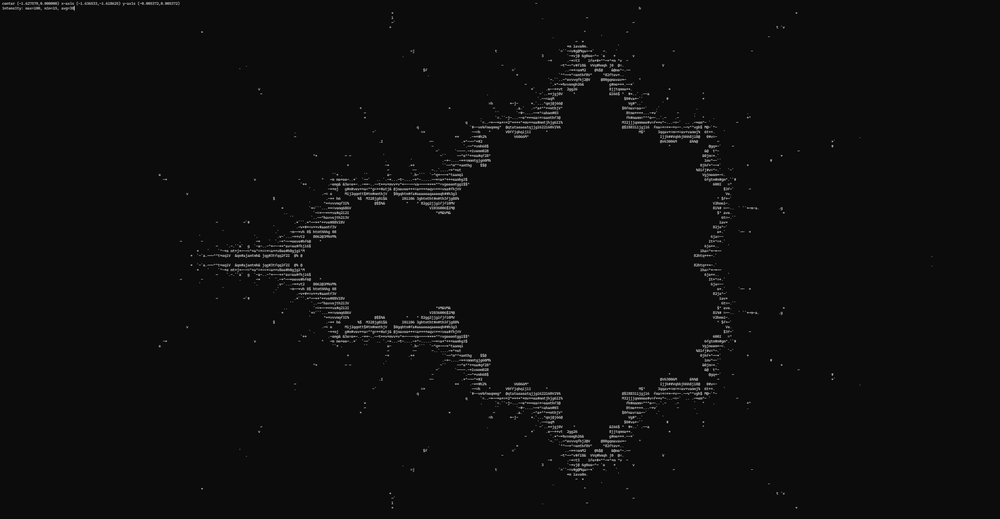

# fractalascii



ASCII drawn Mandelbrot fractal terminal navigator. Made with ncurses.

```shell
$ make fractalascii
```
```shell
$ ./fractalascii
```
## Controls
- `w`, `a`, `s`, `d` - move.
- `e` - zoom in 10%.
- `q` - zoom out 10%.
- `c` - reset camera
